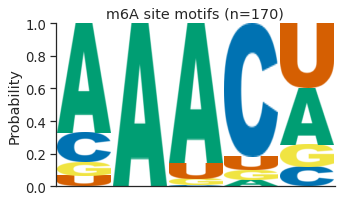

# Sequence motif and distribution analysis for sites found in comparison *fip37-4* vs. Col-0 which are not found in *fip37-4* vs. *fio1-3*

There were 79 sites identified in the comparison *fip37-4* vs. Col-0 which are not found in *fip37-4* vs. *fio1-3*. We flattened any overlapping sites and performed motif analysis. The motif shown below was detected at 45 sites.

    

    

We also used the Araport11 annotation to measure the distribution of identified sites within genic features. The sites were found most densely in 3'UTRs.

    

    

