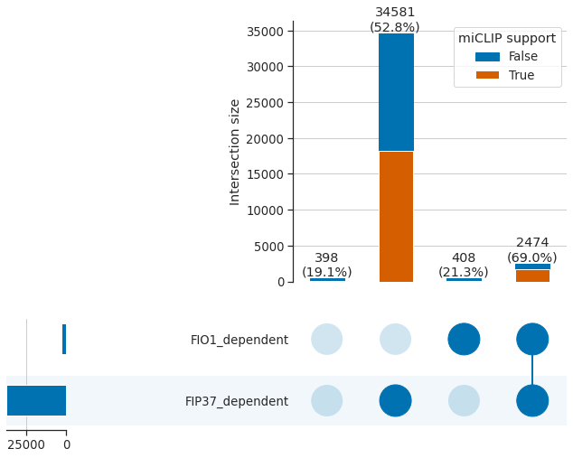
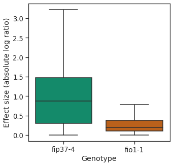
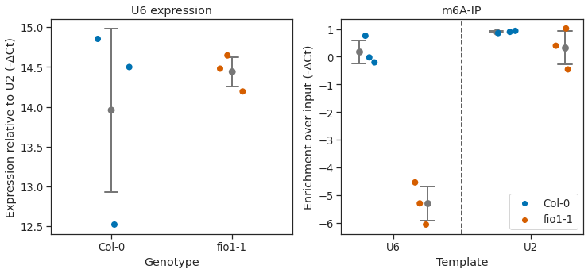

# Intersection plots of modification sites detected in Col-0, *fip37-4* and *fio1-1*

We used the software tool Yanocomp to map differences in mRNA modifications in Col-0, *fio1-1* and *fip37-4*. Yanocomp uses signal level information to train general mixture models that estimate modification rates at each transcriptomic position and can perform greater than two-way comparisons using N-sample G tests. Applying this approach, we identified 37861 positions that had significantly different modification rates in a three-way comparison between Col-0, *fip37-4*, and *fio1-1*. Of these, 97.9% (37055) had significant changes in modification rate in a pairwise-comparison between *fip37-4* and Col-0. In contrast, only 7.6% (2882) had altered modification rates in *fio1-1*.

We used the antibody-based technique miCLIP to perform orthogonal validation of predicted modification sites. FIP37-dependent m6A sites were well supported, with 53.9% (19956) falling within 5 nt of an miCLIP peak. In contrast, of the 408 sites discovered only in *fio1-1*, just 21.3% (87) were within 5 nt of an miCLIP peak.

    

    

Of the sites with sites with altered modification rates in *fio1-1*, 85.8% (2474) also had altered modification rates in *fip37-4*, with larger effect sizes, indicating that they are METTL3-like writer complex-dependent m6A sites whose modification rate is indirectly affected by loss of FIO1.

    

    

## U6 m6A IP analysis

Since FIO1 orthologues methylate U6 snRNA, we next asked if FIO1 was required to modify Arabidopsis U6 snRNA. We used an anti-m6A antibody to immunopurify methylated RNAs from Col-0 and *fio1-1*. We used U2 snRNA, which is m6A methylated in humans, but not by METTL16, as a control. Using RT-qPCR, we could detect equivalent levels of U6 snRNA in the input RNA purified from each genotype, suggesting that the abundance or stability of U6 snRNA is unaffected by loss of FIO1 function. We could detect enrichment of U6 and U2 snRNAs in RNA immunopurified with anti-m6A antibodies from Col-0, indicating that both Arabidopsis U6 and U2 snRNAs are modified by m6A. Methylation of U2 snRNA was unaffected by loss of FIO1 function. On the other hand, we could not detect enrichment of U6 snRNA in the anti-m6A immunopurified RNA from *fio1-1* alleles. These data are consistent with recent reports indicating that Arabidopsis U6 snRNA is m6A modified at the conserved position of the ACm6AGA box and that this modification requires active FIO1.

    

    

