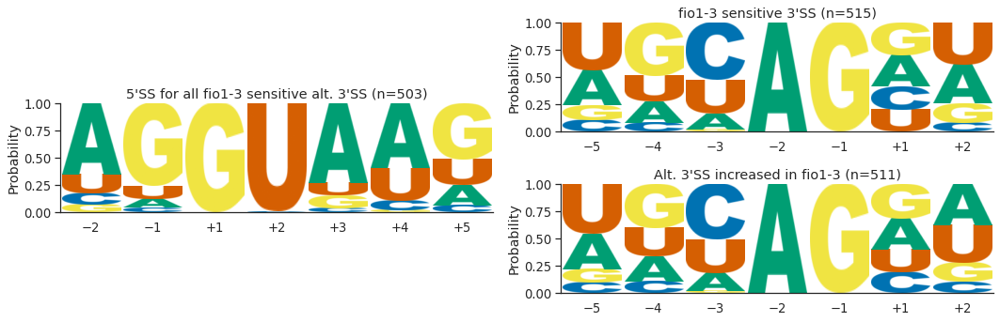
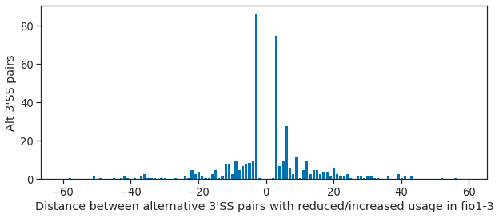
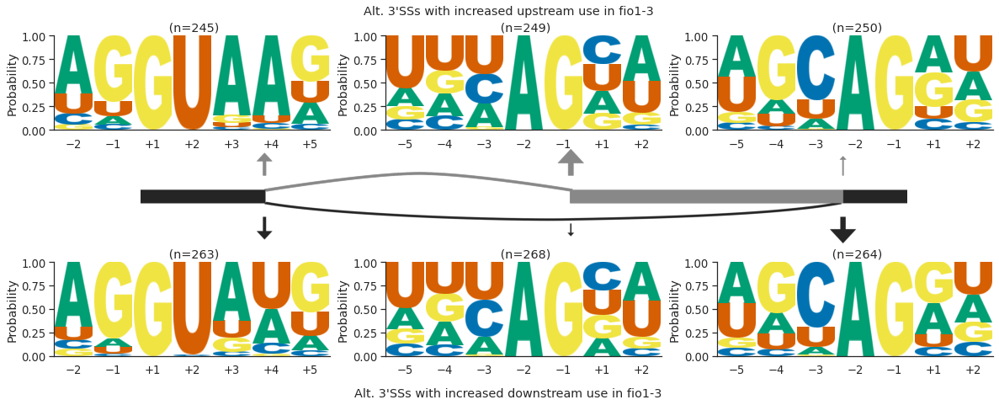

# Alternative 3'SS analysis using reference transcriptome assembly

We observed 525 instances where 3’SS selection was altered in *fio1-3*. In some cases, these alternative 3’SSs were linked with altered 5’SS choice, but this accounted for a relatively small proportion of events. Aggregated motif analysis of all 3’SSs that had either reduced or increased usage in *fio1-3* did not reveal any obvious differences in sequence bias.

    

    

We therefore asked if there were common features in either the directionality of 3’SS switches, or over what distances they occurred. Alternative 3’SS selection was found to be equally likely to switch in an upstream or downstream direction in fio1-3. We found that there was a strong enrichment for very local switching of 3’SSs, with 37.9% of alternative 3’SSs occurring within 5 nt of the fio1-3-sensitive 3’SS, and 30.7% of examples occurring at exactly 3 nt upstream or downstream. These examples correspond to NAGNAG-like acceptors, which have previously been characterised in distinct species including human and Arabidopsis.

    

    

Since 3’SS choice can occur by scanning from the branchpoint to the first available 3’SS motif downstream, selection of a more upstream or downstream 3’SS probably results from either a change in branchpoint or 3’SS motif preference. We therefore separated examples shifting to more upstream and downstream 3’SSs in *fio1-3* and performed motif analysis. At introns where a more upstream 3’SS was preferred in *fio1-3*, we found that 84.9% of the corresponding 5’SSs were characterised by A+4. In these cases, 68.0% of the downstream 3’SSs with reduced usage in *fio1-3* had C—3, compared to only 31.3% of upstream 3’SSs.

Conversely, when we analysed the features of introns where switching to a downstream 3’SS was detected in *fio1-3*, we found that only 36.5% of these 5’SSs had A+4, whereas 49.8% had U+4. In these cases, splicing shifted away from upstream 3’SS with no strong base preference at the -3 position, to downstream 3’SSs with C at the -3 position. These findings link selection of the 3’SS and 5’SS. One interpretation of these findings is that when recognition of the 5’SS by U6 snRNA is favoured by either an m6A:A+4 interaction in WT Col-0 or A:U+4 interaction in fio1-3, this is accompanied by a preference for C—3 at the 3’SS. When the U6 snRNA interaction is less favoured, then the preference for a cytosine at the —3 position of the 3’SS is lost, and so upstream 3’SSs without C-3 are more likely to be used. We conclude that the interactions of U6 snRNA with the 5’SS can influence usage of competing 3’SSs.

    

    

