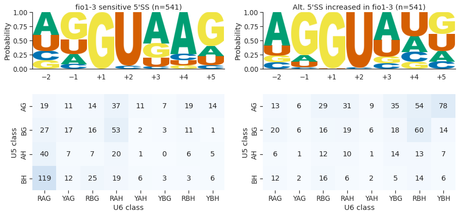

# Alternative 5'SS analysis using reference transcriptome assembly

We identified 565 changes in 5’SS choice caused by loss of FIO1 function. We asked if differences in cis-element features could account for FIO1-dependent 5’SS selection. Comparing 5’SSs that exhibited reduced selection in *fio1-3*, and their corresponding alternative 5’SSs, which were more frequently selected in *fio1-3*, we found that there was a significant difference in base composition at the —2 to +5 positions (G-test p = 1.6e-106). Specifically, we identified a //GURAG motif (R = A or G) at 5’SSs sensitive to the loss of FIO1 function. This motif is consistent with recognition by the U6 snRNA ACAGA box. In contrast, the alternative 5’SSs selected more frequently in *fio1-3* mutants were characterised by an AG//GU motif. This motif is consistent with U5 snRNA loop 1 recognition of the upstream exon sequences. A heat map of the sequence composition of fio1-3-sensitive 5’SSs reveals that they are more likely to be characterised by strong base-pairing matches to the U6 snRNA ACAGA box, but weak matches to U5 snRNA loop 1. In contrast, a heat map of the composition of 5’SS sequences, which are preferentially used in fio1-3, shows strong matches to U5 snRNA loop 1, but weak matches to the U6 snRNA ACAGA box.

    

    

Remarkably, the presence or absence of an A at the +4 position (A+4) correctly separates 73.5% of the 5’SSs exhibiting decreased and increased usage in *fio1-3*. In humans, where pairing of the 5’SS to U6 occurs before activation of the spliceosome, the 5’SS A+4 faces the m6A of the U6 snRNA ACm6AGA box in the B complex before docking of the 5’SS in the active site.

    

    

Of the 5’SSs with increased usage in *fio1-3*, 42.8% have U+4, which could make a Watson-Crick base pair with the corresponding unmethylated residue of U6 snRNA. In total, 52.2% of 5’SS changes in *fio1-3* are associated with a switch from A+4 to B+4 (A→B+4), of which 56.3% were A→U+4. In comparison, only 5.1% of alternative 5’SS pairs are reciprocal B→A+4 switches, indicating that this shift is strongly directional. A further 8.8% of alternative 5’SS pairs are S→U+4, suggesting that a Watson Crick A-U base-pair is favoured when U6 snRNA is not m6A modified. Surprisingly, 28.5% of alternative 5’SS pairs have no difference in base at the +4 position. However, of these 5’SS pairs, the majority are associated with a G→H+5 and/or H→G–1 switch that weakens interactions with the U6 snRNA ACAGA box and strengthens U5 snRNA loop 1 interactions.

    

    

To investigate the statistically significant FIO1-dependent switches in 5’SS preference further, we interrogated the effect size (absolute ΔPSI). The largest effect sizes were associated with A→U+4. In contrast, alternative 5’SS pairs where there was an A+4→A shift had smaller effect sizes. In addition, we found that fio1-3-sensitive 5’SSs with 5’SS G+5 have larger effect sizes, but that G+5 at the alternative 5’SS has no effect, suggesting that G+5 is only deleterious in *fio1-3* when in combination with A+4.

    

    

Finally, we found that *fio1-3*-sensitive 5’SSs with AG//GU motifs had smaller effect sizes, indicating that stronger matches to U5 snRNA loop 1 are able to suppress the effect of unfavourable U6 snRNA interactions in *fio1-3*.

    

    

We next asked whether there was directionality to shifts in splice site choice in *fio1-3*. Alternative 5’SSs were almost equally likely to be selected either upstream or downstream. We detected many examples of 5’SS shifts of exactly -4 nt, +4 nt, and +5 nt. Notably, in +5 nt switches, 5’SSs with the strong U6 snRNA ACAGA recognition sequence //GURAGGU can become strong U5 snRNA loop 1 5’SSs with the sequence GURAG//GU, suggesting that overlaps in the registers of consensus sequences for U5 and U6 snRNA interactions could facilitate alternative splicing.

    

    

    

    

## Temperature alt 5'SS

We analysed the temperature-dependent shifts in splice site choice in the Col-0 RNA-Seq data as a control. In contrast to the clear difference in sequence composition of 5’SSs with altered use in *fio1-3*, there was no significant difference between the positional base frequencies for 5’SSs that were used preferentially at lower and elevated temperatures in Col-0 (G-test p = 0.87). We conclude that the features of 5’SSs sensitive to loss of FIO1 are specific, and not a generic feature of disrupted splicing patterns. 

    

    

