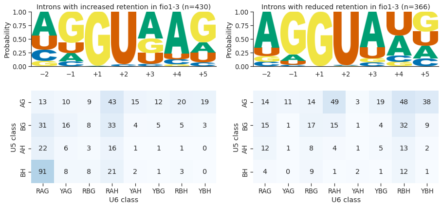

# Retained intron analysis using reference transcriptome assembly

We identified 815 introns with altered levels of retention in *fio1-3*, of which, 54.1% had increased retention and 45.9% had decreased retention (or more splicing). Analysis of 5’SS sequences at introns with increased retention indicates that 77.6% have A+4, and weaker matches to U5 snRNA loop 1. This indicates that these introns are normally recognised by strong U6 snRNA interactions and are less efficiently spliced in the absence of FIO1-dependent U6 snRNA m6A modification.

The remaining introns with significantly altered retention are more efficiently spliced in *fio1-3*. These introns tend to have stronger matches to U5 snRNA loop 1 in the 5’ exon, and only  35.8% have A+4, whilst 44.7% have U+4. This suggests that loss of m6A from U6 snRNA actually increases the splicing efficiency of introns with U at the +4 position of the 5’SS.

    

    

