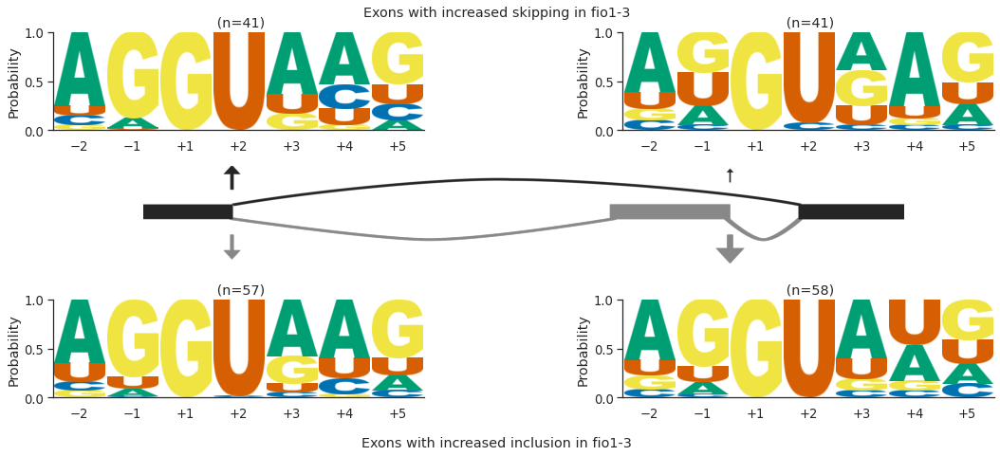
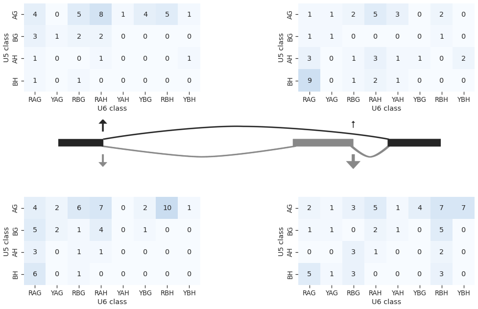

# Skipped exon analysis using reference transcriptome assembly

A common form of alternative splicing involves the excision of an exon and flanking introns in a splicing event called exon skipping. We identified 100 exons with significantly different levels of skipping in *fio1-3*. Of these, 59.0% have increased levels of inclusion, and 41.0% have increased levels of skipping. We considered these two groups separately and performed 5’SS motif analysis.

We found that in cases where exon skipping increased in *fio1-3*, 75.6% of the 5’SS at the downstream intron (i.e. at the 3’ end of the skipped exon) had A+4, in conjugation with weak U5 snRNA loop 1 interacting sequences. In comparison, the 5’SS of the upstream intron was more likely to have a stronger U5 snRNA loop 1 interacting sequence. This is consistent with a relative weakening of the recognition of the 5’SS at the downstream intron in fio1-3. 

    

    

In cases where exon inclusion increased in *fio1-3*, we found that 46.6% of 5’SSs at the 3’ end of the skipped exon had U+4, compared to only 36.2% with A+4. In comparison, 59.6% of 5’SSs upstream of the skipped exon had A+4, indicating that the relative strength of the two 5’SSs changes in *fio1-3*.

    

    

