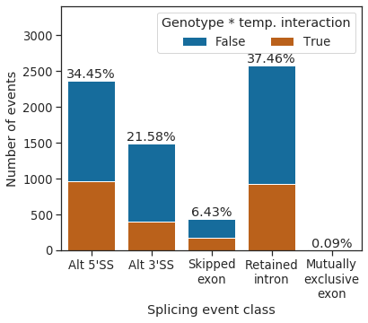

# Initial splicing analysis using *de novo* transcriptome assembly

Consistent with previous studies, we found that intron retention is the predominant class of alternative splicing event detected when Arabidopsis plants are subjected to different temperatures – 44.9% (2924) of the splicing events with alternative usage at different temperatures were retained introns.

    

    

In contrast, when we repeated this analysis to classify alternative splicing events that differ between *fio1-3* and Col-0 backgrounds, we found that a much larger proportion of alternative splicing events were classified as alternative 5’SS usage – 34.4% (2369) of FIO1–dependent splicing events were alternative 5’SSs, compared to only 18.6% (1214) of temperature-dependent events. In addition, we detected changes in the PSI of retained introns, exon skipping and alternative 3’SS selection.

    

    

There was a significant overlap between splicing events sensitive to loss of FIO1, and those that were sensitive to temperature (hypergeometric-test p = 9e-227). However, in 64.2% of fio1-sensitive events, loss of FIO1 did not alter splicing responses to temperature. Of the remaining 2505 splicing events which did have altered temperature sensitivity in the absence of FIO1, 38.4% (961) were alternative 5’SSs, and of these alternative 5’SSs, 69.9% had greater sensitivity to loss of FIO1 at 28oC than at 4oC. This suggests that FIO1 buffers accurate 5’SS selection at elevated temperature.

    

    

